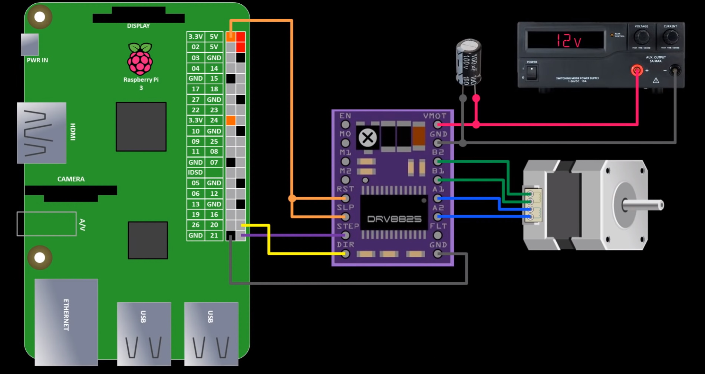

# PiBot_v4
A small roboter based on a raspberry pi zero w, using lidar for locating.

## First scans with the lidar

## Setup

- Install python packages from requirements.txt
- Start pigpio demon on boot
    - `sudo systemctl enable pigpiod`
    - `sudo systemctl start pigpiod`
- Enable serial mode P6 in interacing options (`sudo raspi-config`)

## Printable 3D objects
The robot is designed by myself, the printable 3d objects can be found in the [stls folder](stls/).

## Wiring

Also see [fritzing wiring](docs/PiBot_v4_wiring.fzz).

## Hardware Used

- Raspberry Pi Zero W
- Stepper Motor + Driver (DRV8825) ( 12V 1.5A) x2
- Stepper Motor + Driver ( 5V ULN2003)
- Power Converter
- TF Luna mini Lidar
- Bosch 12v Battery Pack
- Switches x2
- Voltage meter

### DRV8825 wiring

In order to correctly wire the bigger stepper motors, also see this example wiring:

### TF-Luna 

Check the byte codes of the lidar sensor for implementation:

