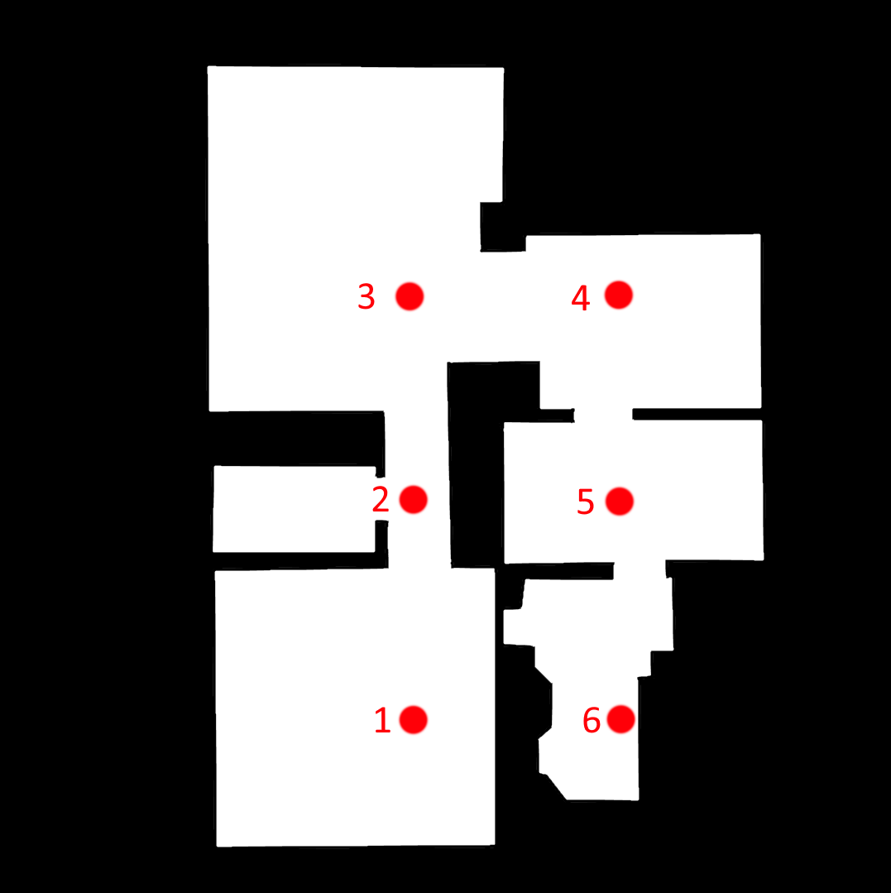
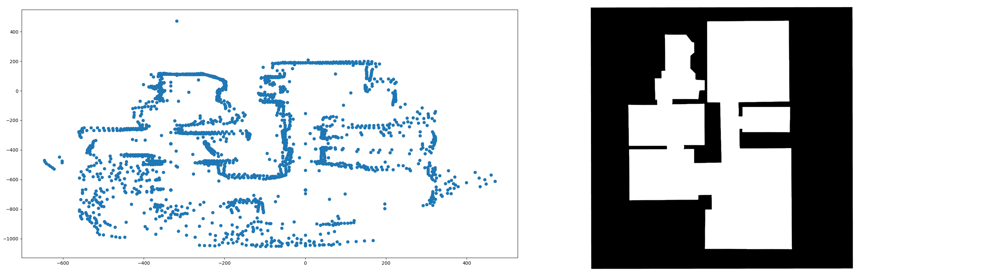
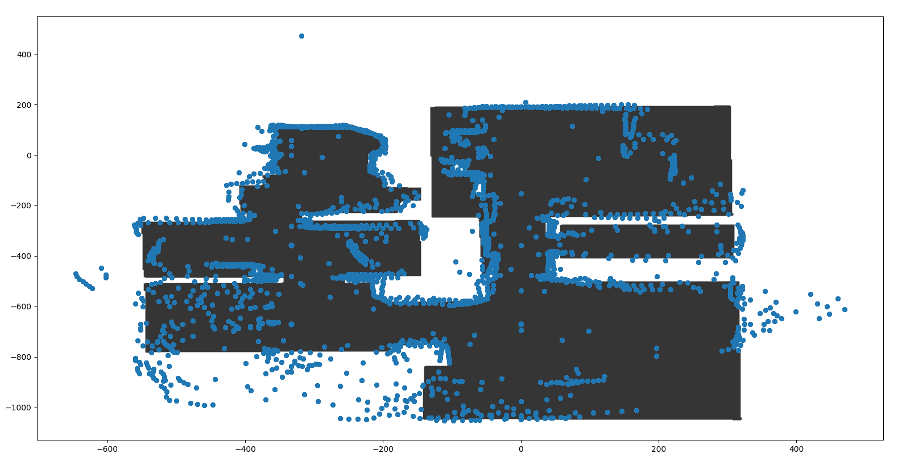

# Flat Mapping Test

## Description

In this test I'm trying to map my flat by doing 360 scans with the robot on  
specified points.  
Therefore, I manually put the robot exactly to on the points and start a 360 scan  
by hand. The points are precisely measured and their offsets will be used to   
translate the resulting scanned coordinates.  
After postprocessing (translating) the scanned points and stitching them together,  hopefully a rough point cloud describing the flat should result.  

## Measurement points

>Note: The robot is facing the bottom of the map

1.      (0, 0)  
1.      (0, -358)       // +0, -358
1.      (0, -671)       // +0, -313
1.      (-333, -671)    // -333, +0
1.      (-333, -358)    // +0, +313
1.      (-333, 0)       // +0, +358

## Results

Here the results of the approaches are listed.

### Manual movement approach

Comparison of the created point cloud map and the ground truth map:  
  
  
  
Comparison of created point cloud map and ground truth map with scaling aligned:  
  
